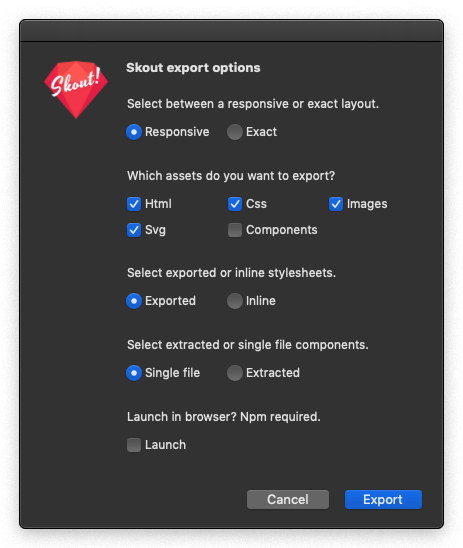

#  Skout! — Sketch Plugin

[](https://api.sketchpacks.com/v1/plugins/com.circledev.skout/download) 
[](https://sketchpacks.com/circledev/skout)
[](LICENSE)

*Skout is a Sketch plugin to export selected artboard to a web ready mockup.*

*Skout is currently in active development.*

*With Skout you can:*

<!--
<a href="https://www.sketchapp.com"></a>
<a href="http://bit.ly/SketchRunnerWebsite"></a>
-->

* Export to html, css, images and svg.
* Export stylesheets with custom grids and css vars.
* Export to web components.
* Launch page preview through `http-server` ([npm](https://nodejs.org) required)
<!--
* Launch page preview through [http-server](https://www.npmjs.com/package/http-server) ([npm](https://nodejs.org) required)
-->


___

## Features

|  | Description |
| --- | --- |
| **Responsive / Exact** | Select between a responsive or exact layout |
| **Html / Css / Images / Svg / Components** | Select the assets you want to export |
| **Exported / Inline** | Select imported or inline stylesheets |
| **Single file / Extracted** | Select single file or extracted component |
| **Launch** | Launch in browser [npm](https://nodejs.org) required |
___

## Demo

* View an example output page [here](https://actarian.github.io/skout/)
* Download the example's sketch file [here](example/mockup.sketch)
___

## Purpose

Skout plugin does _not_ generate production ready web pages. 

Skout plugin generates a structured mockup from your design to help you start developing faster.

___

## Installation

1. [Download the plugin](https://api.sketchpacks.com/v1/plugins/com.circledev.skout/download)
2. Double-click to install `skout.sketchplugin`
3. Select an artboard
4. Press ctrl + cmd ⌘ + S
___

## For optimal results

* `Name your layers usign Blocks, Elements and Modifiers
 notation`.  
 Use [BEM](http://getbem.com/introduction/) notation to name your layers. 

* `Set up the artboard layout settings`.  
Layout settings helps create your css grid system and apply proper column size to your grid aligned divs. Column classes will be applied to properly aligned elements with a tolerance of 1px.

* `Draw your creativity using full width horizontal sections`.  
Every main row of your artboard should be grouped logically into full width sections. eg header, section--hero, section--claim, section--products.. etc.

* `Use symbols whenever possible`.  
Symbols help optimize html and stylesheets avoiding duplicated elements and styles. Symbols do also get exported to [Web Components](https://www.webcomponents.org/introduction).

* `Group sibiling items`.  
Group all items placed horizontally or vertically. Every group represents an outputted html element. Create subgroups for items with different alignments.  

* `Use constraints`.  
Using Sketch constraints helps understand responsive behaviours like alignments and resizes.  
  
  
Find out more in the example [sketch demo file](https://actarian.github.io/skout/)
___

## Contributing

*Pull requests are welcome and please submit bugs 🐞*

*Thank you for taking the time to provide feedback and review. This feedback is appreciated and very helpful 🌈*

[](https://gitHub.com/actarian/skout/network/)  [](https://GitHub.com/actarian/skout/stargazers/)  [](https://github.com/actarian?tab=followers)

* [Github Project Page](https://github.com/actarian/skout) 
* [Sketchpacks.com](https://api.sketchpacks.com/v1/plugins/com.circledev.skout/download)

*If you find this plugin helpful,   
feel free to contribute in keeping this plugin up to date via [PayPal](https://www.paypal.me/circledev/5)*

[](https://www.paypal.me/circledev/5)
___

## Contact

* Luca Zampetti <lzampetti@gmail.com>
* Follow [@actarian](https://twitter.com/actarian) on Twitter

[](https://twitter.com/actarian)

---
## Requirements

* Sketch.app v 52.0.
___

## Todo

* BEM naming conversion to web elements.
___

## Release Notes
Changelog [here](https://github.com/actarian/skout/blob/master/CHANGELOG.md).

### 0.1.1

* Initial release of skout plugin for sketch.

___


_This plugin was created using `skpm`. For a detailed explanation on how things work, checkout the [skpm Readme](https://github.com/skpm/skpm/blob/master/README.md)._
___
### Node

`sudo npm install -g skpm --unsafe-perm`

To start a development live-reload build
  `npm run start`

To build the plugin
  `npm run build`
___
### Usage

Install the dependencies

```bash
npm install
```

Once the installation is done, you can run some commands inside the project folder:

```bash
npm run build
```

To watch for changes:

```bash
npm run watch
```

Additionally, if you wish to run the plugin every time it is built:

```bash
npm run start
```
___
### Help

[developer.sketchapp.com/guides/preferences](https://developer.sketchapp.com/guides/preferences/)
